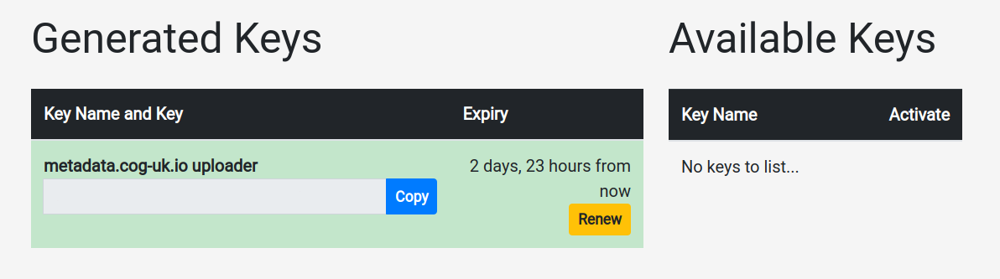

## Generating and accessing an API key from Majora

*You must have two-factor authentification `2FA` enabled to access the API*

Log in to Majora and navigate to your profile page by clicking your username at the bottom of the welcome page.

Then navigate to the API key page by clicking the `Manage API Keys` button, you should be greeted with a page that looks like the following:

If your key does not need to be renewed (must be done every three days) you should then press the `copy` button to copy the key to your clipboard,
then you should paste the key into the `MAJORA_TOKEN` field of your `.ocarina` file in your home directory.
