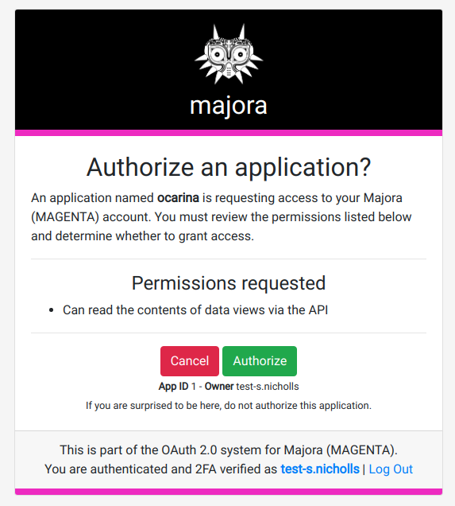
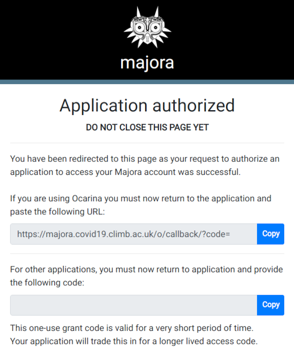

### 0. Register for an account via Majora
[Read the instructions for how to register](register)

### 1. Install the Ocarina client

[Ocarina](https://github.com/SamStudio8/ocarina/tree/master/ocarina) is a command line tool that is used to connect to Majora and perform actions with elevated privileges that are not possible on the website.
It is not terribly difficult to use, but ideally you will have used a command line tool before.

You can install the latest version with the Python package manager. You will probably want to install it into a conda environment on the shared node.

```
conda create -n ocarina python=3.7
conda activate ocarina
pip install git+https://github.com/samstudio8/ocarina.git
```

Please remember to check the [ocarina changelog](https://github.com/SamStudio8/ocarina/blob/master/CHANGELOG.md) periodically and update your client as necessary.

### 2. Register your Ocarina instance as an OAuth application

Instructions to do this are located [here](oauth-app). Only the first section is necessary to set up ocarina but must be done before moving to the next step.

### 3a. Set your Ocarina credentials with OAuth (Recommended)

Create a JSON file in your home directory named `.ocarina`. Note the starting dot.

```
{"MAJORA_DOMAIN": "https://majora.covid19.climb.ac.uk/", "MAJORA_USER": "your-username", "MAJORA_TOKEN": "OAUTH", "CLIENT_ID": "your-client-id", "CLIENT_SECRET": "your-client-secret"}
```

Where:
* `MAJORA_DOMAIN` points to either the domain of the real, or test Majora. Do not miss the `/` at the end of the URL.
* `MAJORA_USER` is your username on the appropriate Majora instance
* `MAJORA_TOKEN` must be set to `OAUTH`
* `CLIENT_ID` is the ocarina Client ID registered with majora [accessible at this majora page](https://majora.covid19.climb.ac.uk/o/applications/)
* `CLIENT_SECRET` is the ocarina Secret ID registered with majora [accessible at this majora page](https://majora.covid19.climb.ac.uk/o/applications/)

OAuth has been the standard way to authenticate since September 2020.

**OAuth tokens expire every 10 hours, instructions for refreshing tokens can be found in section 5 as well as how this can be automated**

### 3b. Set your Ocarina credentials with a legacy API key

[Generate a legacy API key](getting-api-keys) if you haven't already.

Create a JSON file in your home directory named `.ocarina`. Note the starting dot.

```
{"MAJORA_DOMAIN": "https://majora.covid19.climb.ac.uk/", "MAJORA_USER": "your-username", "MAJORA_TOKEN": "YOUR_API_KEY", "CLIENT_ID": "", "CLIENT_SECRET": ""}
```

Where:
* `MAJORA_DOMAIN` points to either the domain of the real, or test Majora. Do not miss the `/` at the end of the URL.
* `MAJORA_USER` is your username on the appropriate Majora instance
* `MAJORA_TOKEN` taken from [this majora page](https://majora.covid19.climb.ac.uk/keys/list/)

Some features (such as reading secure dataviews) are only available via OAuth authentification and will not work with the legacy API keys.

**API keys expire every 3 days and must be renewed by following the [legacy API key documentation](getting-api-keys)**

### 4. Submit an ocarina query and generate an OAuth token

Activate your Ocarina conda environment

```
conda activate ocarina
```

Attempt to access a biosample with the following command

```
ocarina --oauth get biosample --central-sample-id *Insert COG ID here*
```

You should see a message asking you to 'request a grant'. Open the link (or copy it into your a browser on your local machine) to see an approval screen like this:



Then click "Authorize" to confirm that you have indeed requested an OAuth token and you should see a page which looks like this apart from the text boxes will be populated:



Now click the copy button next to the the upper text box to copy the callback URL.

Now paste the copied return URL into Ocarina which should now return your requested dataview.

### 5. Refreshing OAuth tokens

**Please note that this will not renew a legacy API key, that must be done by following the [legacy API documentation](getting-api-keys)**

Now you have fully set up OAuth and Ocarina! 

OAuth tokens expire after **10 hours** after which you will have to generate a new token by following step 4 again. This can by avoided by refreshing your token with the command `ocarina oauth refresh`.

Refreshing your OAuth token can be automated by using a `cron job` scheduled to run at any interval < 10 hours for convenience, the example below will refresh your OAuth token every 6 hours.

To set this up first enter the commands below:

```
$ conda activate ocarina
$ which ocarina
/home/sam/miniconda3/envs/ocarina/bin/ocarina #This is my ocarina path make sure you use your own!

```
Then copy the resulting path.

Enter the command `crontab -e` to edit your crontab and add the command below

```
0 0,6,12,18 * * * {YOUR_OCARINA_PATH} oauth refresh
```

### Further reading

Now you are ready to use Ocarina please see the following pages for more information:

* [How to upload a sample](https://samstudio8.github.io/majora-docs/?shell--ocarina#biosamples)
* [How to upload a library](https://samstudio8.github.io/majora-docs/?shell--ocarina#library)
* [How to upload a sequencing run](https://samstudio8.github.io/majora-docs/?shell--ocarina#sequencing)
